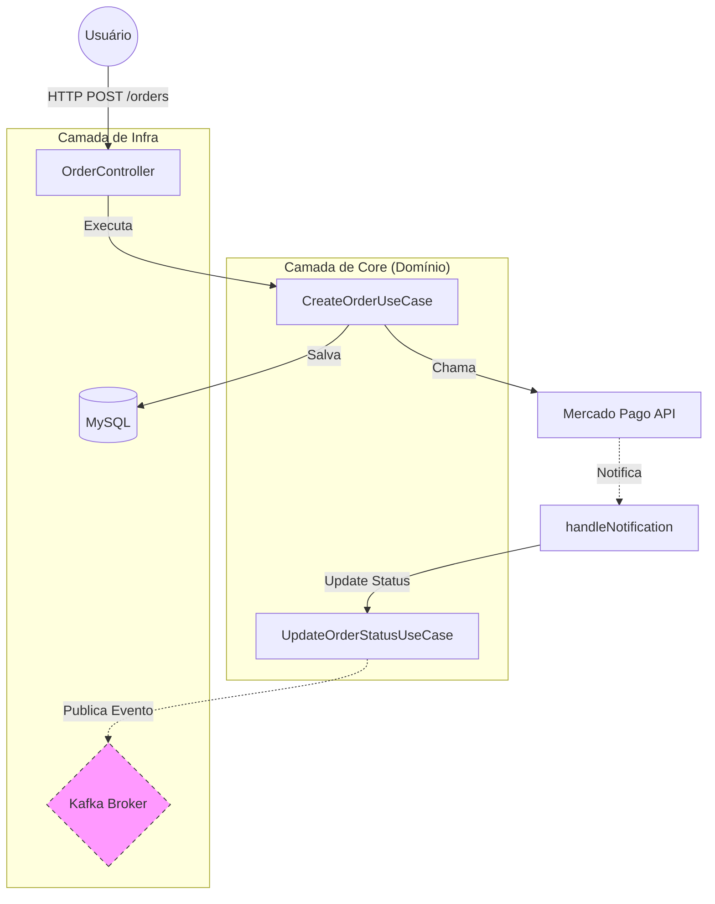

# Payment Service API 💳

API de pagamentos de alta fidelidade desenvolvida com **Java 21** e **Spring Boot 3**, focada em escalabilidade e manutenibilidade através da **Clean Architecture**.

---

## 🏗️ Arquitetura e Fluxo

O projeto utiliza a separação de preocupações para isolar o domínio das tecnologias externas. Abaixo, o fluxo de criação e processamento de um pedido:



### Nota: O componente Kafka Broker representa funcionalidades mapeadas no roadmap para implementação futura de mensageria assíncrona.

---

## 🛠️ Tecnologias e Diferenciais

Java 21 & Spring Boot 3 (Virtual Threads prontas para uso).

MySQL (Persistência robusta).

Docker & Docker Compose (Ambiente 100% replicável).

OpenAPI/Swagger (Documentação interativa).

Resilience4j (Retry Pattern implementado para falhas na API do Mercado Pago).

Spring Actuator (Monitoramento de saúde do sistema).

---

## 🚀 Observabilidade e Testes

1. Documentação Swagger
Acesse para testar os endpoints em tempo real:

http://localhost:8080/swagger-ui/index.html

2. Health Check (Health Indicator)
Verifique se a aplicação e o banco de dados estão operacionais:

http://localhost:8080/actuator/health

🔹 Resiliência de Malha
Para garantir que o sistema não falhe em caso de instabilidade na API do Mercado Pago, implementamos o Retry Pattern. O sistema tentará automaticamente realizar a chamada até 3 vezes com um intervalo de 2 segundos antes de retornar um erro definitivo.

---

## 🐳 Rodando com Docker

A aplicação conta com orquestração completa (App + Banco):

# 1. Gerar o pacote da aplicação
```
mvn clean package -DskipTests
```

# 2. Subir os containers
```
docker-compose up --build
````

---
## 📄 Decisões Técnicas
Clean Architecture: Isolamento total da regra de negócio, permitindo trocar o MySQL pelo MongoDB ou o Mercado Pago pelo Stripe sem tocar no Core.

Logs Estruturados: Uso de SLF4J para rastreamento de transações em tempo real, facilitando o debug em produção.
